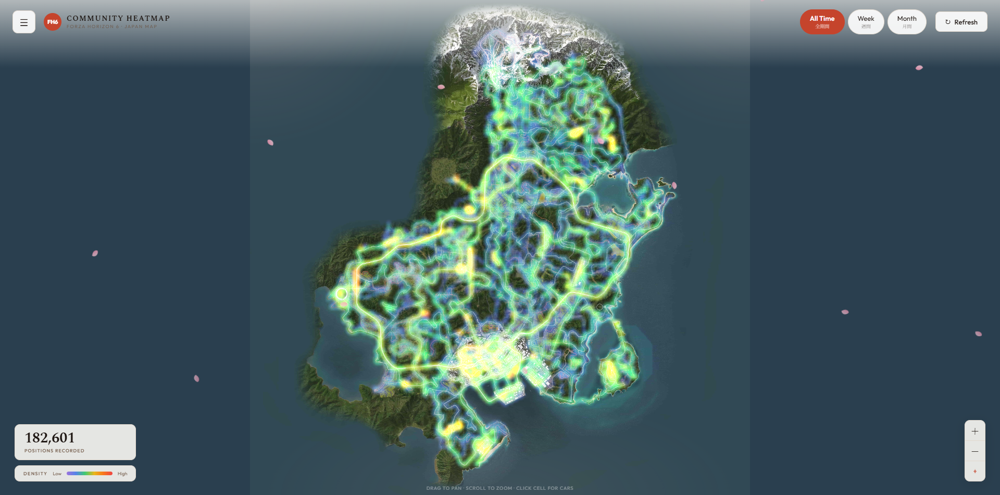
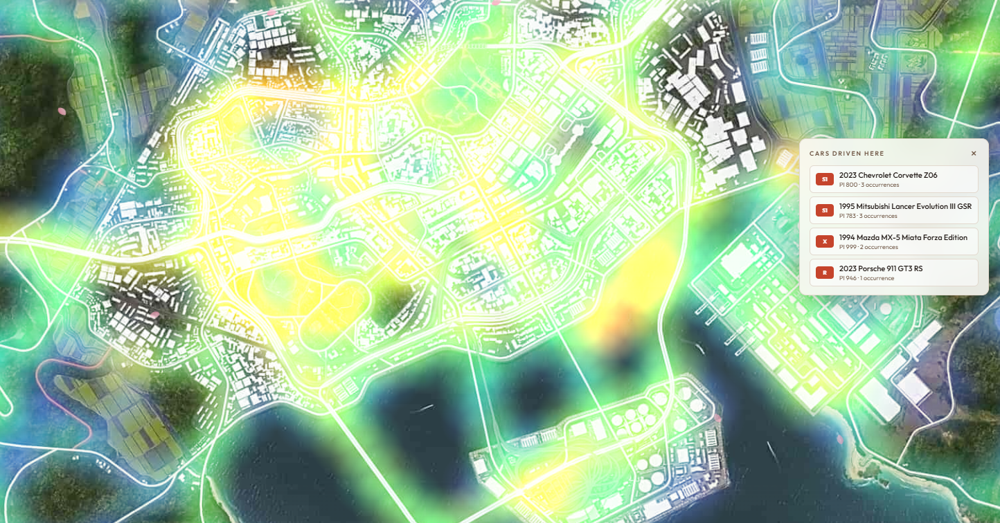
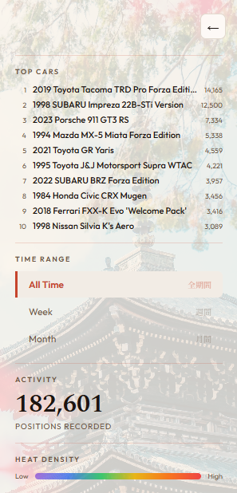
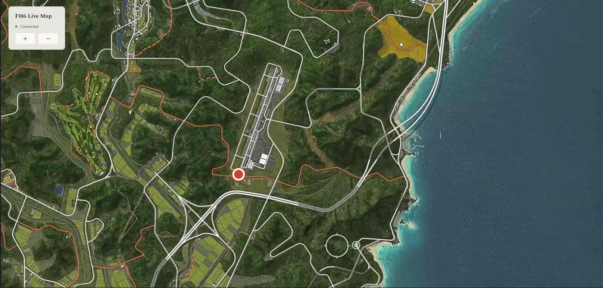
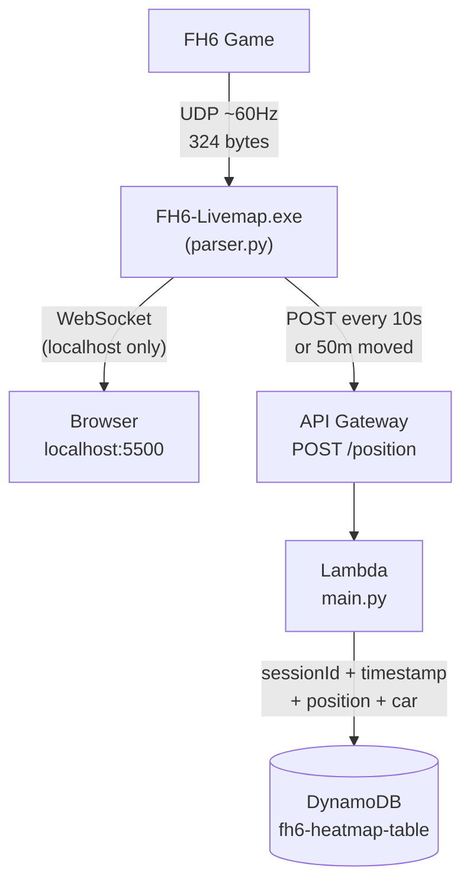
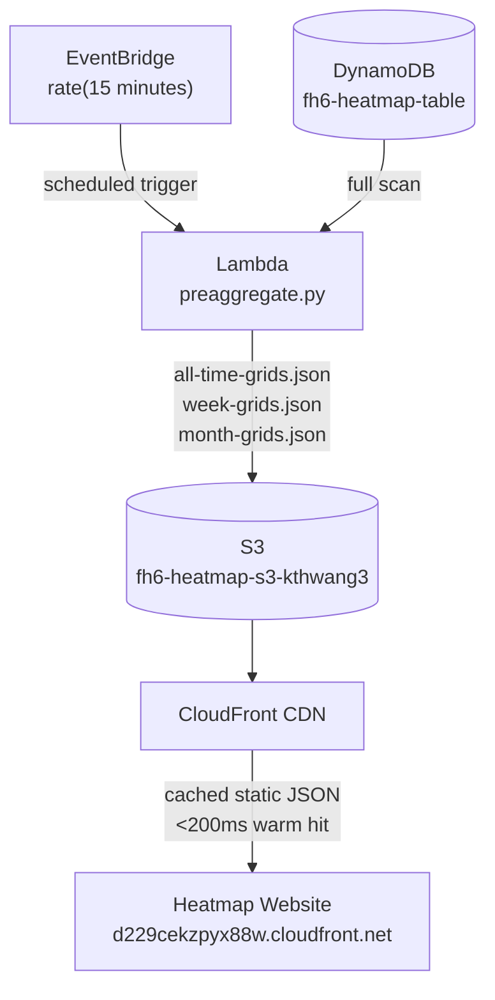
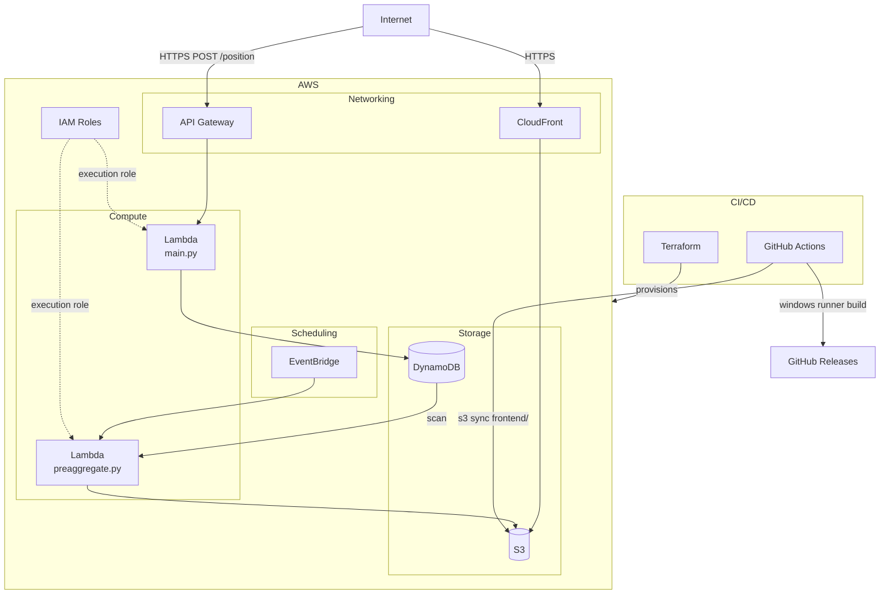

# FH6 Heatmap


Community heatmap + real-time live map for Forza Horizon 6. See where the community drives most — and track your own position on a second monitor while you race.

**Live site:** https://d229cekzpyx88w.cloudfront.net

---

## Download & Setup

### Windows

1. Download `FH6-Livemap.exe` from the [Releases](https://github.com/kthwang3/fh6-heatmap/releases) page
2. Run it — a browser tab opens automatically with the live map
3. In FH6: **Settings → HUD and Gameplay → Data Out**
   - Data Out: **On**
   - Data Out IP Address: `127.0.0.1`
   - Data Out Port: `5301`
4. Start driving — your dot moves on the live map and your position is added to the community heatmap

> **Windows Defender warning:** Windows may flag the .exe as unrecognized. Click **More info → Run anyway**. This is a known false positive for PyInstaller-bundled apps.

### Linux

1. Download `FH6-Livemap-linux` from the [Releases](https://github.com/kthwang3/fh6-heatmap/releases) page
2. Make it executable and run it:
   ```bash
   chmod +x FH6-Livemap-linux
   ./FH6-Livemap-linux
   ```
3. In FH6: **Settings → HUD and Gameplay → Data Out**
   - Data Out: **On**
   - Data Out IP Address: `127.0.0.1`
   - Data Out Port: `5301`
4. Start driving — a browser tab opens automatically with the live map, or open the printed URL manually if it doesn't

---

## Features

- **Community Heatmap** — aggregate heatmap of all recorded positions, filterable by all time / week / month. Updated every 15 minutes.
- **Live Map** — real-time dot on the Japan map served locally over localhost. No data leaves your machine for this feature.

---

## Screenshots

### Website


### City Heatmap


### Leaderboard


### Live Map


---

## Architecture

### Write Path — Telemetry Ingestion



- **300x API call reduction** — 60Hz UDP sampled to 1 POST per 10 seconds before any network call
- **Serverless ingestion** — 1,000 concurrent users, p95 520ms, 0% failure rate across 23,652 requests

### Read Path — Heatmap Delivery



- **<200ms heatmap load time** — CloudFront-cached static JSON vs ~19s live DynamoDB scan before pre-aggregation
- Pre-aggregation runs on a 15-minute schedule, decoupling read latency from table size entirely

---

## Infrastructure

All AWS infrastructure is provisioned as code with Terraform. No resources were created manually.



**API Gateway** — public HTTPS endpoint that receives position POSTs from every running `.exe` instance and forwards them to Lambda. Handles request routing, throttling, and TLS termination.

**Lambda (main.py)** — write handler. Parses the incoming position payload and writes one DynamoDB item per sampled point. Stateless, scales automatically with concurrent users.

**Lambda (preaggregate.py)** — aggregation worker. Runs every 15 minutes, scans the full DynamoDB table, computes three heatmap grids (all time / week / month) and three car leaderboards, then writes six JSON files to S3.

**DynamoDB** — stores every recorded position point as an item with sessionId (partition key), timestamp (sort key), X/Z coordinates, and car metadata. Pay-per-request billing — no capacity planning needed.

**S3** — stores the static frontend (`index.html`, map image) and the pre-aggregated JSON files written by the aggregation Lambda. Also stores Terraform state.

**CloudFront** — CDN sitting in front of S3. Caches the pre-aggregated JSON files at edge locations so the heatmap loads in <200ms regardless of where the visitor is. Also serves the frontend over HTTPS.

**EventBridge** — scheduled trigger (`rate(15 minutes)`) that invokes the aggregation Lambda automatically. No polling, no cron job on a server.

**IAM** — Lambda execution roles with least-privilege policies. The write Lambda has DynamoDB write access only. The aggregation Lambda has DynamoDB read access and S3 write access.

**Terraform** — provisions every resource above as code. `terraform apply` from the `terraform/` directory recreates the full stack from scratch.

**GitHub Actions** — two workflows: `deploy.yml` syncs the frontend to S3 on every push to `main`; `release.yml` builds `FH6-Livemap.exe` on a Windows runner and `FH6-Livemap-linux` on an Ubuntu runner, then uploads both to GitHub Releases on every version tag.

---

## Tech Stack

| Category | Tools |
|---|---|
| Language | Python, JavaScript (React) |
| Cloud | API Gateway · Lambda · DynamoDB · S3 · CloudFront · EventBridge · IAM |
| IaC | Terraform |
| CI/CD | GitHub Actions |
| Distribution | PyInstaller · GitHub Releases |

---

## Prerequisites

For running the script directly instead of the `.exe`:

- Python 3.10+
- `pip install -r requirements.txt`
- FH6 with Data Out configured (same settings as above)

```bash
python parser.py
```

---

## Deployment

**Frontend**
Push to `main` → GitHub Actions syncs `frontend/` to S3 → CloudFront serves it.

**Lambda**
```bash
cd lambda && zip ../lambda.zip *.py
aws lambda update-function-code --function-name <function-name> --zip-file fileb://lambda.zip
```

**Infrastructure**
```bash
cd terraform && terraform apply
```

**New release**
```bash
git tag vX.X.X
git push origin main --tags
```
GitHub Actions builds `FH6-Livemap.exe` on a Windows runner and attaches it to the release automatically.
